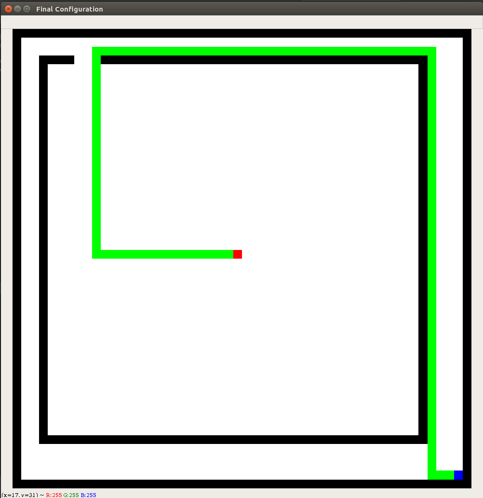
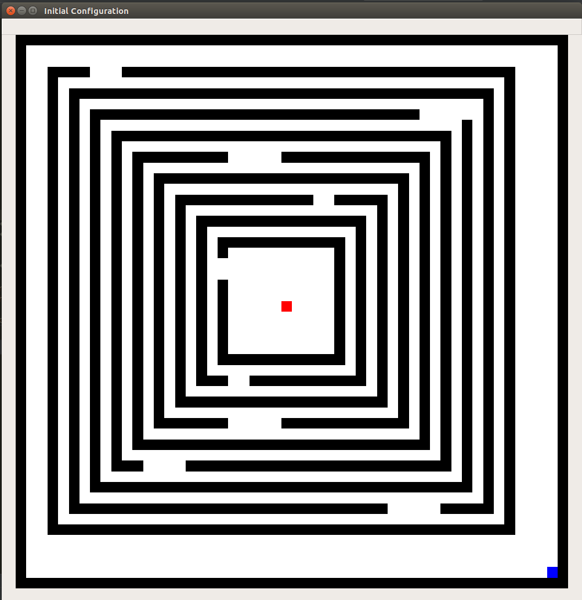

## BFS (Breadth First Search) Visualization using Python and OpenCV

#### First Obstacle Layout

Initial Configuration

    

Final Configuration after the traversal

    

#### Last Obstacle Layout

(Uncomment lines from 39 to 69 in BFS_with_Visualization.py code to get the Last Obstacle Layout)

Initial Configuration

    

Final Configuration after the traversal

    

