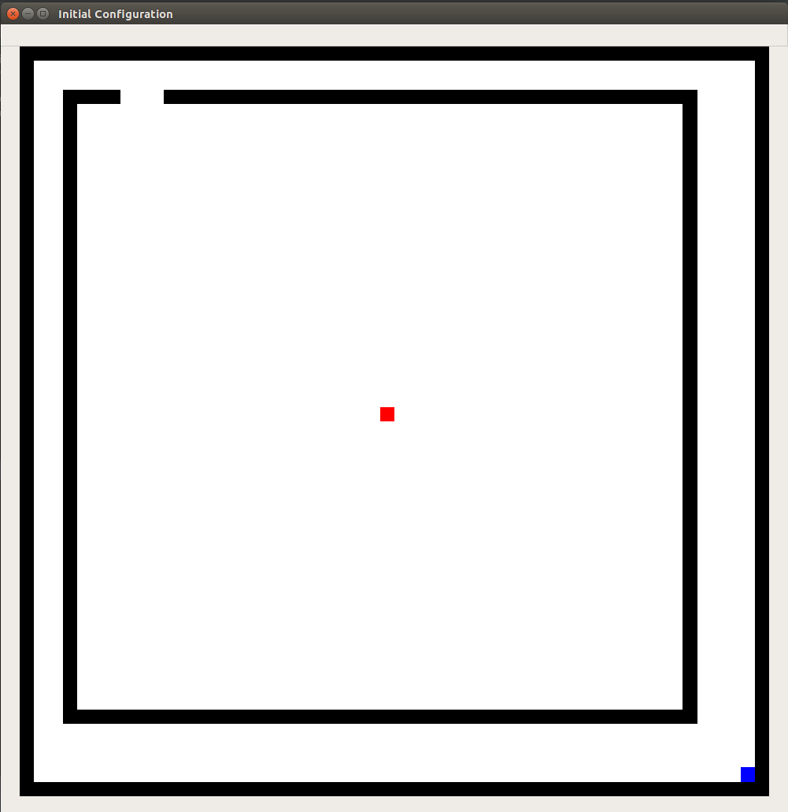
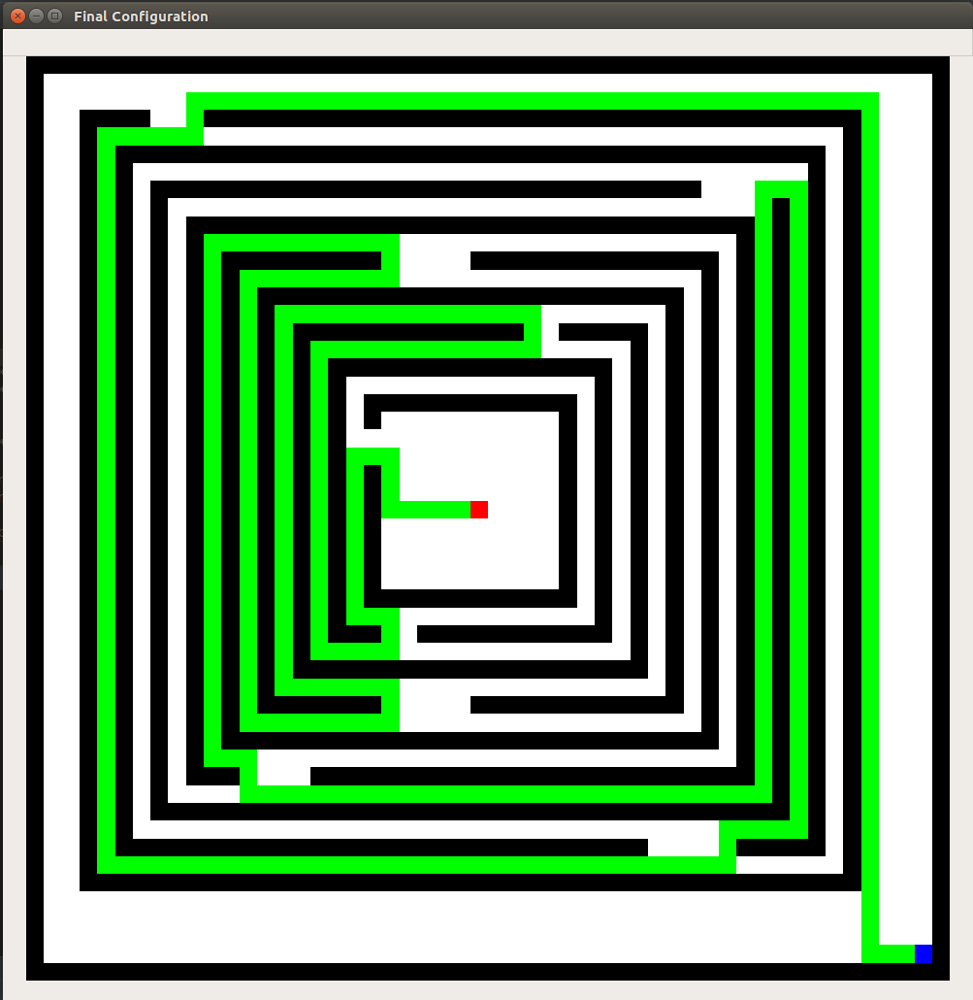

## BFS (Breadth First Search) Visualization using OpenCV

Initial Configuration for the First Obstacle Layout

Final Configuration for the First Obstacle Layout after the traversal

Initial Configuration for the Last Obstacle Layout (uncomment lines from 39 to 69 in BFS_with_Visualization.py code to get the Last Obstacle Layout)

Final Configuration for the Last Obstacle Layout after the traversal

